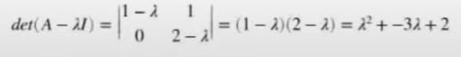

# 7. Eliminációs módszerek, mátrixok trianguláris felbontásai. Lineáris egyenletrendszerek megoldása iterációs módszerekkel. Mátrixok sajátértékeinek és sajátvektorainak numerikus meghatározása

## Eliminációs módszerek
A lineáris egyenletrendszerek megoldására szolgáló eljárások. ($Ax = b$)

### Gauss-elimináció

- $Ax=b$ alakú lineáris egyenletrendszerek megoldásához tudjuk használni
- az $Ax=b$ egyenletrendszernek pontosan akkor van egy megoldása, ha $det(A) \ne 0$
- ekkor $x = A^{-1}b$
    - de az inverzet kiszámolni túl lassú lenne

A Gauss-eliminációval az A mátrixot felső háromszögmátrixszá alakítjuk, és ha ez sikerül, akkor abból visszahelyettesítésekkel megkaphatjuk x-et. **Műveletigénye:** $O(n^2/2)$.

A felső háromszögmátrixot ún. eliminációs mátrixok segítségével kapjuk meg. Egy eliminációs mátrix dolga, hogy kinullázza az A mátrix egyik oszlopában a főátló alatti elemeket. Ha az összes ilyen eliminációs mátrixot összeszorozzuk balról egymással, akkor kapjuk az $M$ mátrixot. 
Ekkor az $M*A$ szorzás eredménye lesz a kívánt **felső trianguláris** mátrix.

### LU felbontás
Szükséges a négyzetes mátrix

Az LU felbontás lényege, hogy az A mátrixot egy alsó és egy felső háromszögmátrixra bontjuk. A Gauss eliminációhoz nagyon hasonlít, ott az **MA szorzás eredménye egy U felső trianguláris mátrix volt**. Ha mindkét oldalt megszorozzuk balról $M^{-1}$-gyel, akkor azt kapjuk, hogy $A = M^{-1}U$. Legyen $M^{-1}=L$, mert $M^{-1}$ egy **alsó trianguláris** mátrix. Ezzel elvégeztük az A mátrix LU felbontását.

Ekkor az Ax=b egyeletrendszer megoldását a következőképpen kaphatjuk:
1. $LUx=b$
2. $Ly=b$ - y egy új mesterséges változó
3. $Ux = y$ - megoldás x-re

### Cholesky felbontás

Ha az **A mátrix**
- szimmetrikus
- pozitív definit (ha minden sajátérték pozitív)
	- Ha az átlóba **csak pozitív** van akkor biztos pozitív definit

akkor felbontható a következőképpen: (Az $LU = x$, ből $U = L^T$)
1. $A=LL^T$ - Ez a Cholesky alak
2. $Ly = b$ - Az $L^Tx = y$ helyettesítésével megoldjuk y-ra
3. $L^Tx = y$ - Végül az $y$ segítségével kifejezzük az $x$-et

2x olyan gyors mint az LU felbontás és **numerikusan stabilis**, ==szóval, ha picit változtatunk az inputon akkor kicsit változik az eredmény.==

### QR felbontás
$Q$: egy **ortogonális mátrix**, tehát$QQ^T = Q^TQ = I$, azaz a **transzponáltja egyben az inverze** is
$R$: egy felső háromszögmátrix

Numerikusan stabilabb ez is.
**Megoldás:**
1. $Rx=Q^Tb$

**Tétel:** Tetszőleges A négyzetes valós reguláris mátrixnak létezik az A = QR felbontása ortogonláis és felső háromszögmátrixra.
**Bizonyítás:**
$A^TA$ pozitív definit, így létezik $R^TR$ Cholesky felbontása.

Legyen ekkor Q egyenlő $A^{R-1}$-gyel.

Igazoljuk, hogy Q ortogonális.

Q^TQ = (AR^{-1})^T (A^R^-1)}= (R^-1)^T\*A^T\*A\*R^-1 = (R^-1)^T\*R^T\*R\*R^-1 = I\*I = I

    behelyettesítés transzponálásos azonosság  A^TA=R^TR inverzek kiütik egymást

Tehát Q valóban ortogonális 

## Lineáris egyenletrendszerek megoldása iterációs módszerekkel

**Iterációs módszerek:** Egy kezdő állapotból, minden iteráció után egyre jobb közelítést adnak a megoldásnak. 

**Nagy méretű mátrixokra**, vagy ha **eliminációs módszerek eredményei kerekitési hibával terheltek**
### Jacobi iteráció

Átrendezzük úgy az egyenletrendszert, hogy a **bal oldalon egy-egy változót kifejezünk**.
Minden egyenlet esetén, úgy oldjuk meg, hogy az i-edik egyenletben az i-edik változó együtthatójával osztunk, majd az i-edik tagon kívűl mindegyiket kivonjuk az egyenletből:

**Formálisan:**
$x^{(k+1)} = -D^{-1}(A-D)x^{(k)}+D^{-1}b$,
- $D$ egy diagonális mátrix (A főátlóbeli elemeit tartalmazza)
- $D^{-1}$-el való szorzás pont az i-edik egyenlet elosztása az i-edik együtthatóval.
- Az $A-D$ a jobb oldalra való átvivést jelképezi.

Választunk valami **indulóvektort**, ami ilyen kezdő megoldás kb
A vektor elemeit behelyettesítjük a jobboldalra, és ebből kapunk egy új vektort a baloldalon, ezzel folytatjuk.

Csak akkor konvergál, ha a mátrix *szigorúan diagonálisan domináns*, vagyis az összes főátlóbeli elem abszolút értéke a legnagyobb az adott sorban.

### Gauss-Seidel iteráció

Ugyanaz, mint a Jacobi, csak ha már **egy változó új értékét kiszámoltuk**, akkor a következő sorokban már azt az **új értéket használjuk**. 

- A Gauss-Seidel gyorsabban konvergál a megoldáshoz, mint a Jacobi

## Mátrixok sajátértékeinek és sajátvektorainak numerikus meghatározása

### Sajátérték, sajátvektor
Legyen $A$ egy négyzetes mátrix.

$Ax = \lambda x$
$x$ a **sajátvektor**, $\lambda$ a **sajátérték**

A sajátérték olyan szám, amivel ha megszorozzuk a hozzá tartozó sajátvektort, akkor ugyanazt az eredményt kapjuk, mintha azt a vektort a mátrixszal szoroztuk volna meg.

**Meghatározása:** $det(A - \lambda I) = 0$
tehát, a főátló minden eleméből kivonunk lambdát, és ennek a mátrixnak keressük a determinánsát
ez egy polinomot fog eredményezni, amiben lambdák a változók, és ennek a **polinomnak a gyökei** lesznek **a sajátértékek**.

Ezt a polinomot nevezzük a mátrix **karakterisztikus polinomjának**.

Valós mátrixnak is lehetnek komplex sajártértékei!
A mátrix sajártértékeinek a halmazát a mátrix *spektrumának* hívjuk.

 # **SZERINTEM EZ NEM KELL**
### Hatványmódszer

A hatványmódszer a legnagyobb abszolútértékű sajátérték meghatározására szolgál.
Iterációs módszer.

$y^k = Ax^k$
$x^{(k+1)} = y^k/||y^k||$

a kiindulási x vektor ne legyen a nullvektor, és nem lehet merőleges a legnagyobb abszolútértékú sajátértékhez tartozó sajátvektorra.

A k betűk a kitevőben a k. iterációt jelentik, nem k. hatványt.

### Inverz hatványmódszer

$Ay=x^k$
$x^{(k+1)} = y/||y||$

Az inverz hatványmódszer azon a felismerésen alapul, hogy ha az A mátrix sajátértéke lambda, és a hozzá tartozó sajátvektor x, akkor A^-1 egy sajátértéke lambda^-1, és a hozzá tartozó sajátvektor x.

