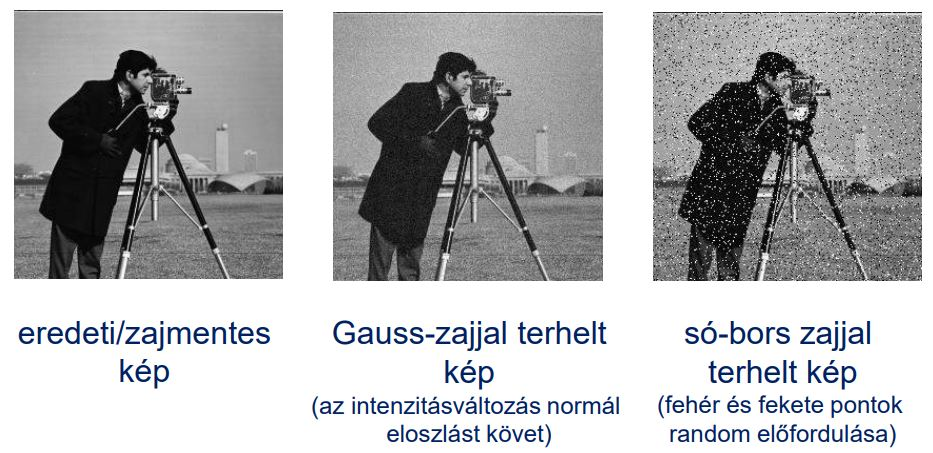

# 3. Simítás/szűrés képtérben (átlagoló szűrők, Gauss simítás és mediánszűrés); élek detektálása (gradiens-operátorokkal és Marr-Hildreth módszerrel)

**Zaj:** A képpont-intenzitások nemkívánatos változása

## Simítás/szűrés képtérben

### Átlagoló szűrés

Vesszük egy képpontnak egy környezetét, és vesszük ebben a környezetben az összes képpont átlagát. Ezzel az átlag lesz a képpont új értéke. 
Ezt az átlagolást konvolúcióval is végezhetjük, ahol a konvolúciós maszkunkban minden érték $\dfrac{1}{n^2}$, ha $n*n$-es a maszk.

- minél nagyobb környezetet nézünk, annál erősebb a simító hatás
- **haszna:**
	-  csökkenti a zajt
- **kára:**
	- gyengíti az éleket
	- homályossá teszi a képet
- **súlyozott átlagolást is lehet csinálni** - konvolúció
    - a legnagyobb súly az aktuális pontunknak legyen
    - ahogy távolodunk a ponttól, annál kisebbek legyenek a súlyok

### Gauss simítás

- ahogy távolodunk a ponttól, annál kisebbek legyenek a súlyok
- erre nagyon jó a gauss harang
- minden sűrűségfüggvény integrálja 1
    - minél nagyobb a $\sigma$ (szigma), annál szélesebb, de annál alacsonyabb a harang
    - ezzel szépen lehet jeleket simítani

- binomiális együtthatók jól közelítik a normális eloszlás görbéjét
- van 2D gauss is, harang alakú

hogyan lehet gauss függvényt közelíteni diszkrét értékekkel?

- vegyük a binomiális együtthatókat tartalmazó sorvektort, és osszunk el minden elemet 2^n-nel
- ezt szorozzuk össze a transzponáltjával, és így kapjuk a gauss görbe közelítését

Hozzájuthatunk így diszkrét gauss eloszlású nxn-es konvolúciós maszkokhoz, és az ilyenekkel vett konvolúció a Gauss szűrés
Az élek itt is rombolódnak

Lehet olyat is, hogy csak akkor simítunk, ha az adott képpont intenzitásának környezeti átlagtól való eltérése meghalad egy T küszöbértéket

### Medián szűrés

**medián** = sorbarendezzük az értékeket, és a középsőt vesszük
$min \le med \le max$

medián nem lineáris

**medián szűrés:**
    nézzük egy környezetét a pontnak, ezt rendezzük sorba, és a középső érték legyen a képpont új értéke
**só-bors zaj eltüntetésére szépen alkalmas**

tiszta képet kapunk, ha pl 5x5-ös környezetben nézve a 25 képpontból max 12 teljesen fekete vagy teljesen fehér képpont van
**megszünteti az egyedi, és kis kiterjedésű kiugrásokat**
**jobban megőrzi az éleket**, mint az átlagolás
**nagy kiterjedésű zajfoltoknál jel-elnyomó**
    a zajt hagyja meg, és a lényeg tűnhet el

## Élek detektálása

**él ott van a képen, ahol az intenzitás valamilyen irányban felugrik, vagy lecsökken**
    
élek nagyon fontosak a látásunban, **ahol markánsak az élek, azokat jól érzékeljük**

Tipikus élprofilok:
*	lehet ideális/lépcsős él
*	lejtős él
*	tető
*	vonal
*	zajos

**tangens:** érintő iránytangense/meredeksége
**első derivált:** hol vannak szélsőértékek, monotonitás
derivált pozitív, nő, negatív, csökken

él ott van, ahol az intenzitásprofil első deriváltja nagy

## Gradiens operátorokkal

többváltozós függvényeket is lehet deriválni, pl parciálisan
    egyik változót lerögzítjük, és a másik szerint deriválunk
**gradiens**: első parciális deriváltakból alkotott vektor
    2D-ben az érintőre merőleges vektor
        ennek van két komponense (x és y szerint vett derivált)

**gradiens nagysága** - *magnitúdó*
első vektornormánál a **gradienskomponensek abszolútértékének az összegét** nézzük
    
    2D-ben a kettes vektornorma az a pitagorasz tételből jön
   
  
2D-ben van a gradiensnek iránya is  **arctan(y/x)**

él iránya a gradiensre merőleges

diszkrét gradiens operátorok

**roberts, prewitt, sobel, frei-chen**

mind a négy módszer konvolúciós maszkpárokat alkalmaz
**1. roberts operátor**
* adott két 3x3-as mátrix, ha az egyikkel konvolválunk, akkor az x irányú parciális deriváltat közelítjük, ha a másikkal, akkor az y irányút
    igazából nem is kell konvolúció
* **x:** a képpont értékéből kivonjuk az északkeleti szomszédját
* **y:** a képpont értékéből kivonjuk az északnyugati szomszédját*

**pro: könnyen számítható
    kontra: zajérzékeny**

**2. prewitt operátor**
* itt is két 3x3-as maszk van, csak kicsit más, mint az előbb
* **x:** baloldali oszlop csupa 1, jobboldali csupa -1, középen 0
* **y:** felső sor -1, alsó sor 1, középen 0

**3. sobel operátor**
* két 3x3 maszk
* ha négyzet mozaikon mintavételezett a képünk
    akkor ami két pixel élen osztozkodik (vízszintesen 	
vagy függőlegesen szomszédos), akkor azok közelebb vannak egymáshoz, mintha csak csúcson érintkeznének
     
**4. frei-chen operátor**
* ugyanaz, mint a sobel, csak 2 helyett gyök(2)

**gradiens maszk tervezése x irányban**
* szimmetrikus ne húzzon el se balra, se jobbra
* asszimetrikus ne húzzon el se fel, se le
* legyen az összege az elemeknek 0

8 irányban élt kereső gradiens operátorok **compass operátorok**

**prewitt compass operátor**
* 8 különböző maszkkal dolgozik, a 8 égtáj irányába
    maszkelemek összege 0

**robinson-3 compass operátor**
* 3-féle elem szerepel a maszkokban (1, -1)
    
**robinson-5 compass operátor**
* 5-féle elem (-2 ,-1 ,0 , 1, 2)

**kirsch compass operátor**
* 0, -3, 5 értékek szerepelnek benne

### Marr-Hildreth módszer

**LoG:** Gauss laplace transzformáltja.
**Laplace:** Gradiens önmagával vett szorzata, amit másodfokú deriváltak közelítésére használnak. SKALÁR

1. konvolváljuk a képet egy vagy több alkalmas **LoG függvénnyel**
2.  keressünk közös **nulla átmeneteket**
 * nulla átmenet ott van, ahol adott pont kis környezetében előfordulnak pozitív és negatív értékek is 
* **eredménye** mindig egy bináris éltérkép
    lehetnek fantomélek is, de ez a gyakorlatban elhanyagolható
    
**LoG a frekvenciatérben**
    konvolúciós tétel szerint **f*LoG** gyorsan számítható fourier-trafóval meg pontonkénti szorzással
    adott szigmára előre kiszámíthatjuk a sombrero fourier trafóját
    ezt is eltárolhatjuk