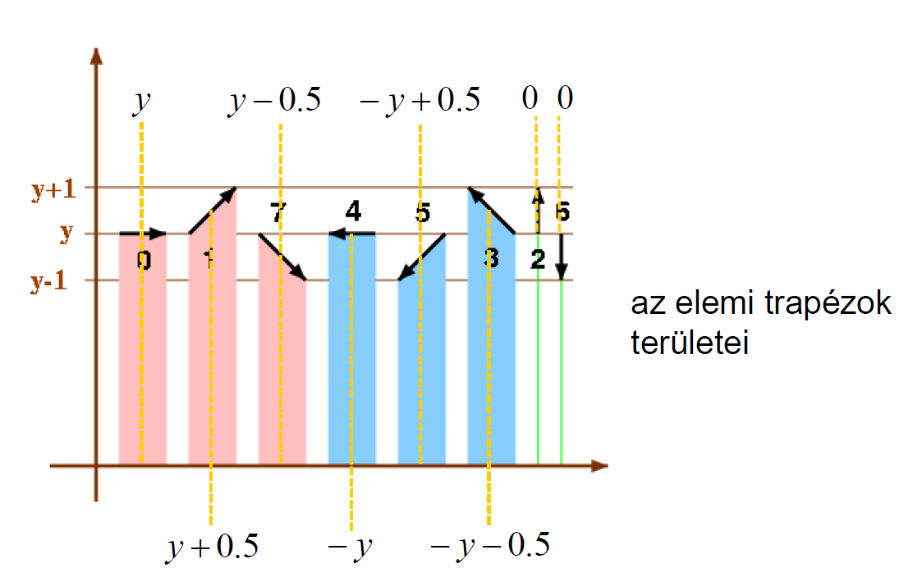
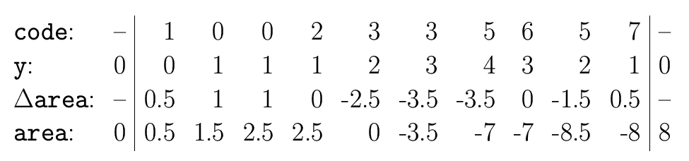
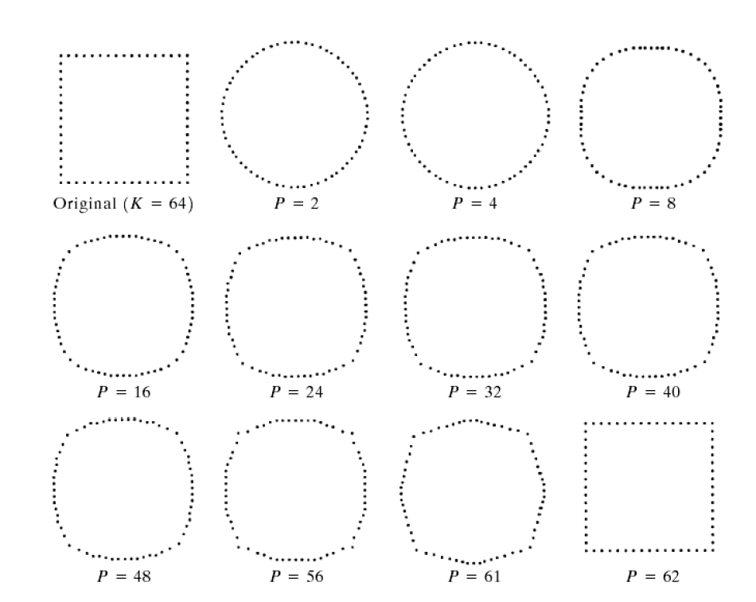
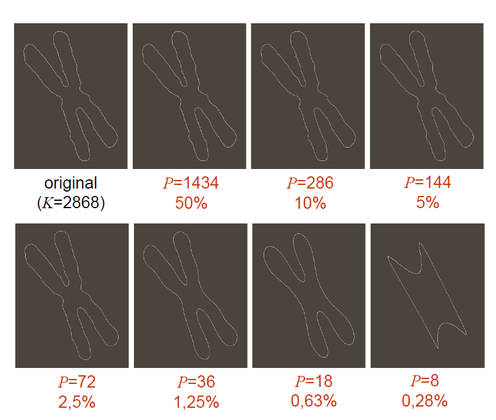

# 4. Alakreprezentáció, határ- és régió-alapú alakleíró jellemzők, Fourier leírás

## Alakreprezentáció

Az alak/forma megítélésének fontos szerep jut a látásunkban.
Az alak (shape) nem bír egzakt matematikai definícióval

A **szegmentálást** követően az objektumok kontúrjaiból vagy foltjaiból (attól függően, hogy **határ-** vagy **régió-alapú** szegmentálást vetettünk-e be) számos **alakleíró jellemzőt** vonhatunk ki.
Hangsúlyozandó, hogy itt már elszakadhatunk a digitális képektől, **némelyik jellemző
csak egy szám**, mások pedig **összetett struktúrák is lehetnek**.

Az alakleíró jellemzőket három osztályba soroljuk. **(Határ, Régió, Transzformációs)**

## Határ alapú alakleíró jellemzők

- lánckód, alakleíró szám
- kerület, terület, kompaktság, cirkularitás
- közelítés poligonnal
- parametrikus kontúr, határvonal leíró függvény
- meredekségi hisztogram
- görbület, energia
- strukturális leírás

#### Lánckód
- Az alakzat határpontjait követi/láncolja az óramutató járásával ellentétes irányban.
- **Határpont:** Az alakzat olyan pontja, melynek van az alakzathoz nem tartozó 8- ill, 4-szomszédja.
- **Különböző kezdőpontból más lánckód jöhet ki!**

**Pozitivumok:**
- Invariáns a forgatásra, ha a szög $k*\pi/2$, eltolásra
- Gyors algoritmus, eltolás-invariáns
- kompakt

**Hátrányok:**
- Zaj érzékeny, 
- nem skála-invariáns
- pontosság legfeljebb pixelnyi lehet

**Különbségkód:** a lánckód első deriváltja, a szomszédok elemek közötti elmozdulások száma
**Normalizálás:** Addig permutáljuk a különbségkódot, amíg a legkisebb értékű kódot kapjuk.
**Alakleíró szám:** A normalizált különbségkód (NEM FÜGG A KEZDŐPONT VÁLASZTÁSTÓL)

### Kerület, terület számítása

- A kerület és a terület két gyakran bevetett alakleíró jellemző. Mindkettő származtatható a lánckódból is.
- **8-as lánckód esetén:** 
	- kerület = gyök(2) * (páratlan elemek száma) + páros elemek száma a lánckódban
- **4-es lánckód esetén:**
	-  kerület = lánckód rendje (hossza)

**poligon területe 8-as lánckód esetén:** 
- számontartunk egy y-t, ami kezdetben 0. Ehhez ha a lánckódban lévő következő szám "felfele" mutat hozzáadunk 1-et, ha "lefele", akkor kivonunk 1-et
	- a területváltozást szintén a lánckódban következő szám iránya határozza meg (y alapján), ahogy az alábbi képen is látszik
	- a területet úgy kapjuk, hogy folyton összeadogatjuk a területváltozásokat, és a végén vesszük az abszulútértékét

### Kompaktság és cirkularitás, görbület

- kompaktság = **(kerület)^2 / terület**
- cirkularitás = **terület / (kerület)^2**
- **görbület:** a határhoz rajzolt érintőkör sugarának reciproka

### Parametrikus kontúr
- A parametrikus kontúr két egyváltozós függvénnyel reprezentálja a szegmenst. A kontúron végighaladva követjük az $x$ és az $y$ koordináták változásait.

### Leírás egyváltozós függvényekkel (Szignatúra)
Pl. A súlypontnak a határtól vett távolságát a szög függvényében fejezi ki.
Nagyban függ az alakzat méretétől és a határon vett kezdőponttól. $\rightarrow$ normalizárásra szorul.

- Csillag-szerű objektum:
	- Van olyan pontja, amelyből induló tetszőleges irányú sugár a határt egyetlen pontban metszi.

## Régió alapú alakleíró jellemzők

A határ-alapúakhoz hasonlóan, számos régió-alapú alakleíró jellemzőt javasoltak.

- befoglaló téglalap, rektangularitás
- főtengely, melléktengely, átmérő,
excentricitás, főtengely szöge
- konvex burok, konvex kiegészítés,
konkávitási fa, partícionált határ,
- vetületek, törés-költség
- topológiai leírások, Euler-szám,
szomszédsági fa,
- váz,
- momentumok, invariáns momentumok

### Befoglaló téglalap, rektangularitás

- ==**álló befoglaló téglalap:**== az objektum koordinátáinak minimumai és maximumai **megadják az álló befoglaló téglalap csúcsait.**
- minimális befoglaló téglalap
- ==**rektangularitás:**== Azt mondja meg, hogy az objektum „bedobozolásakor” mennyi a tárgy és a „levegő” által elfoglalt területek aránya, tehát ---> **alakzat területe / minimális befoglaló téglalap**

### Főtengely, melléktengely, átmérő, excentricitás, főtengely szöge

- **főtengely:** az alakzaton belül haladó leghosszabb egyenes szakasz
- **melléktengely:** az alakzaton belüli, a főtengelyre merőleges leghosszabb egyenes szakasz
- **átmérő:** a határ két legtávolabbi pontját köti össze. A főtengely hossza általában nem egyezik meg az átmérővel (csak a
konvexeknél)
- **excentritás:** a fő- és melléktengely hosszaránya: $\dfrac{d1}{d2}$
- **főtengely szöge:** a főtengely és az x-tengely által bezárt szög

### Konvex burok, konvex kiegészítés, konkávitási fa, partícionált határ

- **konvex burok:** az alakzatot tartalmazó minimális konvex alakzat
- **konvex kiegészítés:** a konvex burok és az alakzat különbsége
- **konkávitási fa:** A fa gyökere a kiindulási alakzat, az első szinten a konvex különbség alakzatai helyezkednek el, melyekre a faépítést rekurzív módon folytatjuk.
- **partícionált határ:** A konvex burok határát osztja fel részekre.

### Vetületek, törés-költség

- **vetületek:** A bináris képekből képzett nem-negatív egészekből álló (1D) tömbök.
- **törés-költség:**	 A vetületek továbbragozása, kiszűri a zajos képek oszlopaiban lévő „magányos” objektumpontokat.

### Topológiai leírások, Euler-szám, szomszédsági fa,

- **topológiai leírások**
	- *bináris kép:* kétféle érték lehet benne, az 1-es az alakzatot (komponenst) reprezentálja feketével, míg a 0-s a hátteret(lyukakat) fehérrel
	- *komponens:* maximálisan összefüggő fekete halmaz
	- *üreg:* a negált kép egy véges komponense
- **Euler-féle szám:** egyetlen egész szám$\rightarrow$ *komponensek száma - üregek száma*.
	-	Rengeteg képre lehet az ugyanaz. Valamit elárul a képről, de önmagában keveset.
- **összefüggőségi-fa:** A bináris képekhez rendelt irányított gráf **@kép (Osszefuggosegi_fa.JPG)**
	- minden egyes csúcs megfelel a kép egy (fehér vagy fekete) komponensének,
	- a gráf tartalmazza az (X,Y) élet, ha az X komponens „körülveszi” a vele szomszédos Y komponenst

### Váz

A váz egy gyakran alkalmazott régió-alapú alakleíró jellemző, mely leírja az objektumok általános formáját.\
Alapvetően 3-féleképp határozhatjuk meg:
1. a vázat az objektum azon pontjai alkotják, melyekre kettő vagy több legközelebbi határpont található.

2. Az objektum határát (minden pontjában) egyidejűleg felgyújtjuk. A váz azokból a pontokból áll, ahol a tűzfrontok találkoznak és kioltják egymást. (Feltételezzük, hogy a tűzfrontok minden irányban egyenletes sebességgel, vagyis izotropikusan terjednek.)

3. A vázat az objektumba beírható maximális (nyílt) hipergömbök középpontjai alkotják. Egy beírható hipergömb maximális, ha őt nem tartalmazza egyetlen másik beírható hipergömb sem.

**Invariáns az eltolásra, elforgatásra és az uniform skálázásra.**

### Momentumok, invariáns momentumok

**Pro:** 
Egy szám
* többszintű képekre is értelmezettek, invariánsak a főbb geometriai műveletekre
	* rotálás, eltolás, skálázás, tükrözés stb..

Bizonyos (centrális) momentumoknak geometriai jelentés is tulajdonítható, illetve fontos jellemzők kifejezhetők a segítségükkel, például súlypont.

Javasoltak viszont 7 ún. invariáns momentumot is (ld. 56. dia), amelyekhez nem
társíthatók különösebb jelentések, de a belőlük alkotott rendezett hetesek (vagy akár
hármasok, ha nem vesszük mindet figyelembe) jól jellemzik az objektumokat.

## Transzformációs megközelítés

### Fourier transzformáció
**Ez egy transzformáción alapuló alakleírás**

==**Transzformáljuk** (szigorúan 1D Fourier transzformációt alkalmazunk) **a határ K darab mintavételezett pontjából képzett $s$ vektort**. **Az eredményül kapott $a$ vektor adja a Fourier leírást.** (vagyis tartalmazza a Fourier együtthatókat, a transzformáció bázisfüggvényeinek súlyait)
Az alakzat rekonstrukciójához az inverz
Fourier-transzformációt kell végrehajtani.==

A K darab Fourier együtthatóból visszakaphatnánk torzítatlanul az eredeti mitnavételezett pontokat, az alakleíráshoz viszont
nem az összes súlyt, hanem csak egy részüket tartjuk meg, mindössze P<K darab
együttható alapján térünk vissza a képtérbe
- ekkor a képtérben ismét K darab pontot kapunk vissza, de nem a kiindulás mintavételezettjeit.
- Az együtthatók egy részének eldobásával kapott leírás
(a meghagyott együtthatók adják a jellemzést) voltaképpen egy veszteséges
tömörítés: kevesebb adattal tudjuk jól-rosszul közelíteni a kiindulásit.

Az alábbi kép azt mutatja, hogy hogy a 64 kontúrponttal mintavételezett négyzetre csak
sok együttható megtartásával tudunk négyzetfélét rekonstruálni.

A következő képen viszont tesztobjektum határa közel 3000 ponttal adott,
és már 36 együttható is visszaadhat 3000 pontot úgy, hogy azok jól közelítik a
kiindulási kontúrt.
